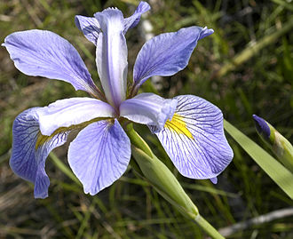
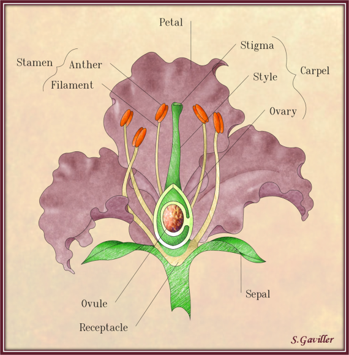

```{r setup, include=FALSE}
library(knitr)
library(tidyverse)
library(plotly)
knitr::opts_chunk$set(echo = FALSE,fig.show = 'hold',fig.align = 'center')

```

## Introduction
<p>
The examination of organisms on earth privides insight into evolutionary and selective breeding processes.
</p>
<p>
The well-known and widely used iris data set (Fisher's or Anderson's) gives the measurements in centimeters of the variables sepal length, sepal width, petal length, and petal width. The  data comprise measurements from 50 flowers from each of 3 species of iris. The species are Iris setosa, versicolor, and virginica.
</p>

* The iris data set is frequently used to demonstrate or practice data manipulation, regression, and machine learning concepts. 

* The app I have built lets the user visualize the dataset via two interactive plots.

### App Location
The app can be accessed here:
https://peernisse.shinyapps.io/plotExplorer/

### Presentation Source Code
The code for this presentation can be found here:https://github.com/peernisse/dataProducts/blob/gh-pages/Week_4_Assignment/presentation/week4Presentation.Rmd

## Iris Species

Below are images of each ofthe three iris species for a little bit of reference while using the app. Each species has different lengths and widths of sepals and petals. The ratio of sepal and petal length is somewhat unique to each species.


<div class="row">
  <div class="column">
  <h3>Iris setosa</h3>
  
  </div>
  
  <div class="column">
  <h3>Iris versicolor</h3>
  
  </div>
  
  <div class="column">
  <h3>Iris virginica</h3>
  
  </div>
</div>

## Iris Anatomy
<div class="row">
  The image below points out the primary structures of an iris flower, including the petal and sepal, which are the main parameters included in the Iris dataset.
</div>

<div class="row">
  
</div>


## Examples
Below are examples of the scatter plot and boxplot you can interact with within the app. Within the app, you can select species, select x and y variables for a scatterplot, and select the faceting variable used in the boxplots.

**NOTE:** While plotly ineraction exists in this presentation, it is not included in the app. The interactivity in the app is contained in the R Shiny code only.

<div class="row">

  <div class="column2">
    
```{r scatter}
g<-ggplot(iris,aes(x=Sepal.Width,y=Sepal.Length,color=Species))+
      theme(plot.margin = margin(0.5,0.1,0.1,0.1,unit = 'in'))+
      geom_smooth(method='lm')+
      geom_point(size=2)+
      theme(legend.position = 'bottom',legend.title=element_blank(),
            title = element_text(size=14,face='bold'))+
      labs(x='Sepal Width (cm)',y='Sepal Length (cm)',
           title='Relationship of Iris Sepal Length and Width by Species')

plotly::ggplotly(g)

```

  
  </div>

  <div class="column2">
  
```{r boxplots}
df<-iris %>% 
  gather(Parameter,Result,1:4)

b<-ggplot(df,aes(x=Parameter,y=Result,color=Species))+
      theme(plot.margin = margin(0.5,0.1,0.1,0.1,unit = 'in'))+
      geom_boxplot()+
      facet_wrap(~Species)+
      theme(legend.position = 'bottom',legend.title=element_blank(),
            title = element_text(size=14,face='bold'))+
      labs(x='Flower Part Parameter',y='Size (cm)',
           title='Summary of Iris Sepal Length and Width by Species')

plotly::ggplotly(b)

```

  
  </div>

</div>


## References
<ul>

  <li> Becker, R. A., Chambers, J. M. and Wilks, A. R. (1988) The New S Language. Wadsworth & Brooks/Cole. (has iris3 as iris.)</>
  
  <li>R Core Team (2018). R: A language and environment for statistical
  computing. R Foundation for Statistical Computing, Vienna, Austria.
  URL https://www.R-project.org/.</>
  
  <li>Winston Chang, Joe Cheng, JJ Allaire, Yihui Xie and Jonathan
  McPherson (2019). shiny: Web Application Framework for R. R package
  version 1.3.2. https://CRAN.R-project.org/package=shiny</>

</ul>


